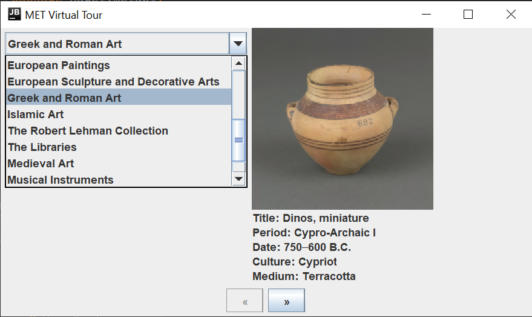

# MET Museum API Display
The Metropolitan Museum of Art comes to life in this virtual tour based on the [MET API](https://metmuseum.github.io/). A drop-down menu allows the user to select from the various departments. Once a department is selected, the user can traverse through the objects of said department. 

When available, the following metadata of each object is displayed:
* Image 
* Title
* Culture
* Period
* Date
* Medium 

This project demonstrates:
1. APIs
1. JSON
1. [Retrofit](https://square.github.io/retrofit/)
1. Gson
1. Gradle
1. Mockito
1. Model-View-Controller pattern
1. Factory pattern
1. Executable Jar Files
1. Markdown

Download Executable [jar File](build/libs/MetAPI-1.0-SNAPSHOT.jar)

